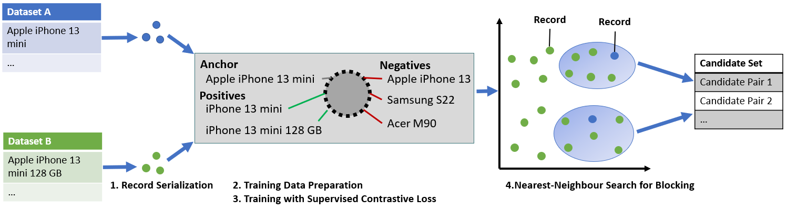

# SC-Block

SC-Block is a blocking method that utilizes supervised contrastive learning for
positioning records in the embedding space, and nearest neighbour
search for candidate set building. 
In this repository we share the code for SC-Block to reproduce the results of the paper "SC-Block: Supervised Contrastive Blocking within Entity
Resolution Pipelines" and for benchmarking SC-Block
against eight state-of-the-art blocking methods. In order to relate
the training time of SC-Block to the reduction of the overall runtime
of the entity resolution pipeline, we combine SC-Block with
four state-of-the-art matching methods into complete pipelines.



## Requirements

* Python 3.9
* Running [Elasticsearch](https://www.elastic.co/what-is/elasticsearch) instance

Install conda environment with required packages
```
conda env create -f environment.yml
```

## Result reproduction

To reproduce the results run the following scripts consecutively from the root directory:

- `src/scripts/01_prepare_datasets.sh` prepares the datasets (query table and index table)
- `src/scripts/02_preprocess_records_and_index_es.sh` loads the contents of the index table into an elastic search index.
- `src/scripts/03_process_training_data.sh` prepares the contrastive training. Running this script is optional, as we provide the training data in the folder `src/finetuning/open_book/contrastive_pretraining/data`.
- `src/scripts/04_load_data_into_faiss.sh` embeds records and loads the embeddings into faiss. Please be aware that you have to train the respective models first.
- `src/scripts/05_run_strategy.sh` runs selected blocking and matching strategies.

After running the experiments, the results can be found in the folder `data/results`.

### Train contrastive models
Navigate to the folder `src/finetuning/open_book/contrastive_pretraining/src/contrastive`

## Dataset WDC Block
The datasets WDC Block small and WDC Block medium are found in the folder `data/deepmatcher`.
The dataset WDC Block large is too large for this repository and can be downloaded via the following [link](https://drive.google.com/file/d/1d-6TIxV1cn8AErwfevTnLI6GMplPbqxI/view?usp=drive_link).
